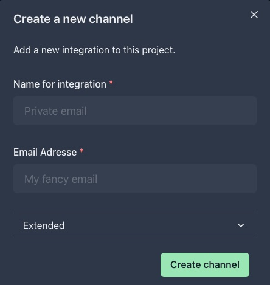

# Email

Email integration is the most popular and probably the easiest integration.

## Set up Email

1. Open the integrations settings of your project
1. Click `Add` at Email to add a new Email integration
   1. Set a custom name
   2. Enter a valid email address
1. Click on `Create` to create the new integration

